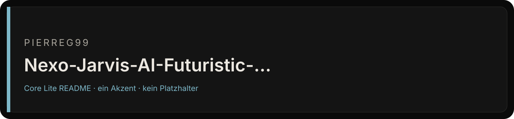

<div align="center">



# Nexo-Jarvis-AI-Futuristic-Assistant-Alpha

Futuristische, browserbasierte AI-Personal-Assistant-Dashboard-Oberfläche mit holografischem Kern, Voice-UI und HUD-Modulen.

[](https://github.com/Pierreg99/Nexo-Jarvis-AI-Futuristic-Assistant-Alpha)
[](https://github.com/Pierreg99/Nexo-Jarvis-AI-Futuristic-Assistant-Alpha)
[](https://github.com/Pierreg99/Nexo-Jarvis-AI-Futuristic-Assistant-Alpha)

</div>

<table>
<tr>
<td width="58%" valign="top">

### Bestand

Futuristische, browserbasierte AI-Personal-Assistant-Dashboard-Oberfläche mit holografischem Kern, Voice-UI und HUD-Modulen.

Der Default-Branch `main` ist die Fläche, die zählt. Was nicht in diesem Baum liegt, ist kein Feature dieses Repos.

</td>
<td width="42%" valign="top">

### Fakten

| Feld | Wert |
| --- | --- |
| Owner | Pierreg99 |
| Branch | `main` |
| Sichtbarkeit | öffentlich |
| Sprache | TypeScript |
| Archiv | nein |

</td>
</tr>
</table>

## Lesen

1. Default-Branch öffnen.
2. Nur Dateien in diesem Baum als Beleg nehmen.
3. Issues und Diskussionen nur nutzen, wenn sie im Repo eingeschaltet sind.

## Grenze

Keine Qualitätszahl, kein Paketstand und keine Runtime, die nicht als Datei in diesem Repo steht.

<p align="center"><sub>Fläche nach Cryo Core Lite v1.5 · Tokens #0A0A0A / #141414 / #7EB8C9</sub></p>


<details>
<summary>Bisheriger README-Text</summary>

# Nexo Jarvis

Eine persönliche Command-Bay mit orbitaler 3D-Oberfläche, Browser-Sprachsteuerung und einer gemeinsamen Ausführungsschicht für Browser und Node-Server. Befehle führen echte, validierte Aktionen aus; Ergebnisse und Fehler erscheinen in Conversation, Trace und Audit.

## Funktionen

- **Knowledge:** Notizen, Fakten und Präferenzen speichern, durchsuchen und löschen; Löschen lässt sich unmittelbar rückgängig machen.
- **Timers & reminders:** Countdown-Timer mit sichtbarer Restzeit, einmalige und wiederkehrende Erinnerungen sowie Pause, Fortsetzen und Löschen.
- **Notifications:** Abgelaufene Timer und Erinnerungen lesen und bestätigen; optionale Desktop-Benachrichtigungen bei geöffnetem Nexo.
- **Terminal:** Ausgeführte Tools, Berechtigungen, Abschlussstatus und Fehler prüfen; Trace und Audit exportieren.
- **System monitor:** Tatsächlicher Runtime-Status, aktive Aufgaben und Tool-Registry.
- **Voice controls:** Englische/deutsche Spracherkennung, auswählbare Browser-Stimme, Geschwindigkeit und optionaler Sprachausgang.
- **Settings:** Name, Read-only-Modus, manuelle Wetterkoordinaten und vollständiger Workspace-Export. Einstellungen bleiben im Browser gespeichert.
- **Live data:** Open-Meteo-Wetter und aktuelle Nachrichten mit Hacker-News-Fallback; ungültige oder unsichere Nachrichtenlinks werden entfernt.
- **AI conversation:** Optionaler OpenAI-kompatibler oder vorhandener Manus-Provider, mit jüngster Conversation und passenden gespeicherten Notizen als Kontext. API-Schlüssel bleiben auf dem Server.
- **Orbital UI:** Lazy-loaded WebGL-Kern, vollständiger lokaler SVG/CSS-Fallback, Immersivansicht, Responsive Layout und Vollbild mit `F`.

## Schnellstart

Node.js **22+** und die in `package.json` festgelegte pnpm-Version verwenden. Corepack vermeidet Versionskonflikte mit global installiertem pnpm:

```bash
corepack enable
corepack pnpm install --frozen-lockfile
cp .env.example .env
corepack pnpm dev
```

Ohne API-Schlüssel, OAuth oder Datenbank funktionieren Notizen, Timer, Erinnerungen, Voice und öffentliche Live-Daten. Im Node-Betrieb wird ein isolierter Workspace über eine HttpOnly-Session zugeordnet; angemeldete Benutzer erhalten ihren eigenen Workspace.

### Befehle

| Beispiel                                | Wirkung                                        |
| --------------------------------------- | ---------------------------------------------- |
| `Remember: Review the launch checklist` | Notiz speichern                                |
| `Merke dir: Wasser trinken`             | Deutsche Notiz speichern                       |
| `Read my notes` / `Zeige meine Notizen` | Gespeicherte Notizen lesen                     |
| `Find notes about launch`               | Inhalt und Tags durchsuchen                    |
| `Set a 5 min timer for tea`             | Countdown mit Titel starten                    |
| `Stelle einen Timer auf 5 Minuten`      | Deutschen Timer starten                        |
| `Remind me in 1 hour to stretch`        | Einmaligen Countdown starten                   |
| `Remind me every 30 minutes to stretch` | Wiederkehrende Erinnerung anlegen              |
| `Show timers` / `Show reminders`        | Aktive Aufgaben auflisten                      |
| `Cancel timer tea`                      | Timer über eindeutigen Titel oder ID abbrechen |
| `Weather` / `News`                      | Echte aktuelle Daten lesen                     |
| `System status` / `Summarize today`     | Runtime bzw. Workspace-Briefing lesen          |
| `Help`                                  | Unterstützte Befehle anzeigen                  |

Timer unterstützen Sekunden, Minuten, Stunden und kombinierte Dauern bis sieben Tage. Einmalige Erinnerungen mit konkretem Datum sowie wiederkehrende Intervalle lassen sich im Modul **Timers & reminders** erstellen.

### Optionaler AI-Provider

Für einen persönlichen Server in `.env` konfigurieren:

```dotenv
OPENAI_API_KEY=your-server-side-key
OPENAI_BASE_URL=https://api.openai.com/v1
NEXO_AI_MODEL=gpt-4.1-mini
```

AI-Anfragen sind standardmäßig nur für angemeldete Benutzer verfügbar. Ein vertrauenswürdiger persönlicher Server ohne OAuth kann zusätzlich `NEXO_AI_ALLOW_GUESTS=true` setzen. Dies gibt allen Besuchern dieses Servers Zugriff auf den konfigurierten AI-Provider. Für öffentlich erreichbare Installationen authentifizierten Zugriff verwenden.

Alternativ werden `BUILT_IN_FORGE_API_KEY` und `BUILT_IN_FORGE_API_URL` unterstützt. Bei AI-Anfragen werden die letzten Gesprächseinträge und passende Notizen an den konfigurierten Provider übertragen. Modellantworten lösen keine Tools oder externen Aktionen aus; Schreibaktionen erfolgen über explizite Befehle und validierte Eingaben.

## Betrieb und Deployment

### Node-Server

```bash
corepack pnpm check
corepack pnpm test
corepack pnpm build
corepack pnpm start
```

Der Build verwendet standardmäßig `/` als Basis. `/api/health` meldet den Backend-Status. Der Browser erkennt das Backend automatisch und verwendet die Workspace-APIs unter `/api/trpc`.

Workspaces werden atomar als JSON-Dateien unter `NEXO_DATA_DIR` (Standard: `.nexo-data/`) gespeichert. Dieses Verzeichnis auf einem persistenten Volume halten und sichern. Dateinamen werden aus der Benutzer-/Session-ID gehasht; Fehler beim Lesen oder Speichern werden gemeldet, ohne beschädigte Daten zu überschreiben. Der Scheduler lädt gespeicherte Workspaces beim Serverstart und verarbeitet fällige Aufgaben weiter. Diese Ablage ist für **einen Node-Prozess und persönliche Installationen** ausgelegt; für mehrere Replikas eine gemeinsame Datenbank und einen koordinierten Scheduler einsetzen.

### GitHub Pages / statische Installation

Die vorhandene Pages-Pipeline setzt automatisch `VITE_BASE_PATH=/Nexo-Jarvis-AI-Futuristic-Assistant-Alpha/`. Router, Favicon und lokale Assets respektieren diese Basis. Zum manuellen Bauen:

```bash
VITE_BASE_PATH=/Nexo-Jarvis-AI-Futuristic-Assistant-Alpha/ corepack pnpm build
```

Ohne Node-Backend verwendet Nexo dieselbe Befehlslogik mit `localStorage`. Notes, Conversation, Timer, Erinnerungen und Audit überleben Reloads im selben Browserprofil. GitHub Pages hostet keine Server-APIs und bietet allein keine AI-Provider-Verbindung.

Browser-Erinnerungen benötigen eine laufende Seite. Geschlossene oder vom Betriebssystem pausierte Browser können nicht geweckt werden; verpasste Aufgaben werden beim nächsten Öffnen nachgeholt. Verpasste Wiederholungen erzeugen eine zusammengefasste Benachrichtigung und behalten ihren Zeitrhythmus. Benachrichtigungen werden in der eigenen Nexo-Oberfläche erzeugt; es werden keine E-Mails, Nachrichten oder externen Kalenderereignisse versendet.

## Architektur und Berechtigungen

`Input → Command plan → Validated tool calls → Result → Trace → Audit`

- `shared/nexo/` — gemeinsame typisierte Command-, Tool-, Memory-, Timer- und Reminder-Engine
- `shared/liveData.ts` — zentrale Wetter-/Nachrichtenabfragen mit Timeouts
- `server/nexo2/runtime.ts` — isolierte persistente Workspaces und Scheduler
- `server/nexo2/conversation.ts` — optionaler serverseitiger AI-Adapter
- `server/routers.ts` — tRPC-Verträge
- `client/src/hooks/useAssistant.ts` — Backend-Erkennung und Browser-/Server-Transport
- `client/src/components/WorkspacePanels.tsx` — funktionsfähige Workspace-Module
- `client/src/pages/Home.tsx` — Command-Bay, Live-Daten und Voice

Tools haben `read`, `write` oder `high-risk` als Berechtigungsstufe. Read-only-Befehle können keine Notizen oder Aufgaben schreiben. Hochriskante registrierte Tools benötigen sowohl passende Berechtigung als auch zusätzliche explizite Bestätigung; öffentliche Agent-APIs akzeptieren ausschließlich `read` und `write`. Auch blockierte Tool-Ausführungen werden protokolliert. Gesprächs- und Audit-Historien sind begrenzt; bei voller Notizablage werden keine alten Notizen stillschweigend gelöscht.

Externe Google-/Outlook-Kalender sind weiterhin nicht verbunden und benötigen eine tatsächliche Provider-/OAuth-Integration. Brow

… gekürzt, Original bleibt in der Git-Historie.

</details>
