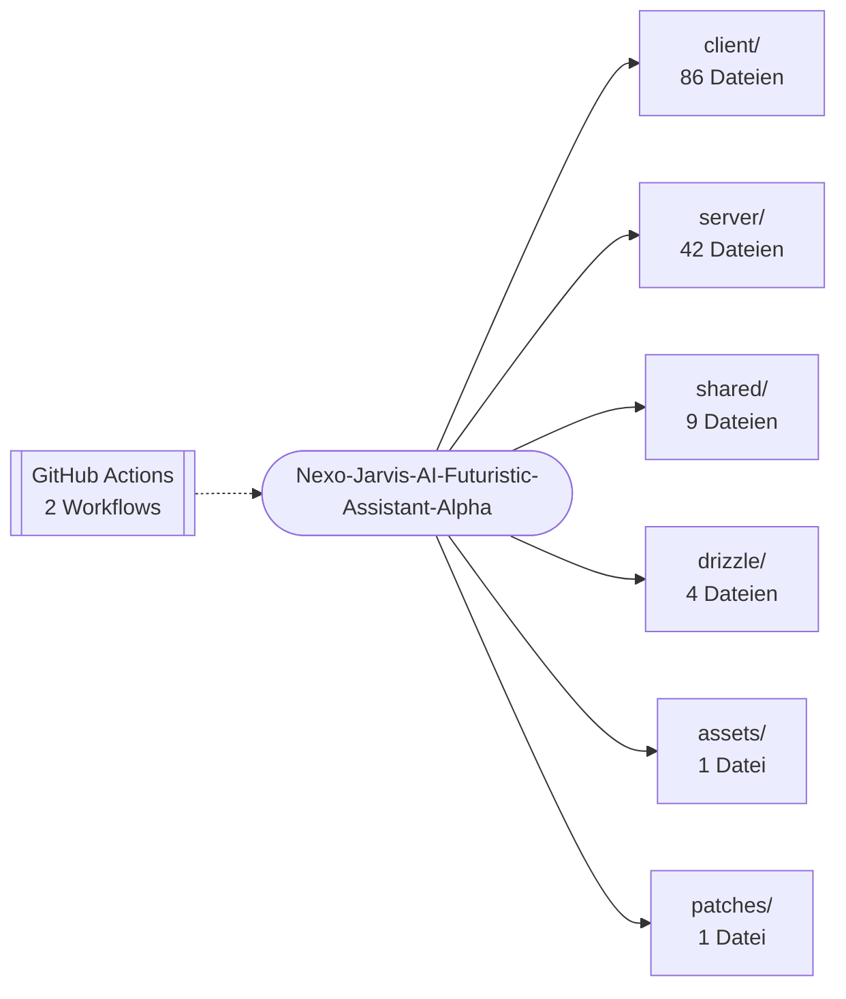

<div align="center">


# Nexo Jarvis

<p><strong>Futuristische, browserbasierte AI-Assistant-Dashboard-Oberfläche mit holografischem Kern, Voice-UI und HUD-Modulen.</strong></p>
<p>


</p>
<p>
<a href="https://github.com/Pierreg99/Nexo-Jarvis-AI-Futuristic-Assistant-Alpha/actions/workflows/deploy-pages.yml"></a>
<a href="https://github.com/Pierreg99/Nexo-Jarvis-AI-Futuristic-Assistant-Alpha/actions/workflows/quality.yml"></a>
</p>
<p><a href="#schnellstart">Schnellstart</a> · <a href="#projektstruktur">Projektstruktur</a> · <a href="#english-summary">English</a></p>
</div>

<table>
<tr>
<td width="58%" valign="top">

### Bestand

Futuristische, browserbasierte AI-Personal-Assistant-Dashboard-Oberfläche mit holografischem Kern, Voice-UI und HUD-Modulen.

Der Default-Branch `main` ist die Fläche, die zählt. Was nicht in diesem Baum liegt, ist kein Feature dieses Repos.

</td>
<td width="42%" valign="top">

### Fakten

| Feld | Wert |
| --- | --- |
| Owner | Pierreg99 |
| Branch | `main` |
| Sichtbarkeit | öffentlich |
| Sprache | TypeScript |
| Archiv | nein |

</td>
</tr>
</table>

---

## Inhaltsverzeichnis

- [Bestand und Fakten](#bestand)
- [Überblick](#überblick)
- [Features](#features)
- [Schnellstart](#schnellstart)
- [Architektur](#architektur)
- [Projektstruktur](#projektstruktur)
- [Dokumentation](#dokumentation)
- [Projektdetails](#projektdetails)
- [English summary](#english-summary)

## Überblick

Futuristische, browserbasierte AI-Assistant-Dashboard-Oberfläche mit holografischem Kern, Voice-UI und HUD-Modulen.

| Merkmal | Wert |
| --- | --- |
| Sprachen | TypeScript (90%), CSS (5%), JavaScript (4%) |
| Dateien im Repository | 185 |
| Version (`package.json`) | 1.0.0 |
| CI-Workflows | 2 |

## Features

- 3D-Rendering mit Three.js
- Deklarative 3D-Szenen mit React Three Fiber
- Benutzeroberfläche mit React
- Entwicklungsserver und Build mit Vite
- Styling mit Tailwind CSS
- Datenzugriff über Drizzle ORM
- HTTP-Server mit Express
- Animationen mit Framer Motion
- Schema-Validierung mit Zod
- Tests mit Vitest
- Typprüfung mit TypeScript
- WebGL2-Rendering
- Lokale Speicherung im Browser (localStorage)
- Sprachein- oder -ausgabe über die Web Speech API
- Echtzeit-Render-Schleife (requestAnimationFrame)
- Automatisierung über GitHub Actions: `deploy-pages.yml`, `quality.yml`
- Veröffentlichung über GitHub Pages
- 7 Testdateien im Repository
- 26 Markdown-Dokumente

## Schnellstart

```bash
git clone https://github.com/Pierreg99/Nexo-Jarvis-AI-Futuristic-Assistant-Alpha.git
cd Nexo-Jarvis-AI-Futuristic-Assistant-Alpha
```

**Node.js**

```bash
pnpm install
pnpm dev
pnpm start
pnpm build
pnpm test
pnpm check
```

<details>
<summary>Alle Skripte aus <code>package.json</code></summary>

| Skript | Befehl |
| --- | --- |
| `dev` | `NODE_ENV=development tsx watch server/_core/index.ts` |
| `build` | `vite build && esbuild server/_core/index.ts --platform=node --packages=external --bundl...` |
| `start` | `NODE_ENV=production node dist/index.js` |
| `check` | `tsc --noEmit` |
| `format` | `prettier --write .` |
| `test` | `vitest run` |
| `db:push` | `drizzle-kit generate && drizzle-kit migrate` |

</details>

## Architektur

Übersicht der wichtigsten Verzeichnisse nach Anzahl der enthaltenen Dateien.



## Projektstruktur

```text
Nexo-Jarvis-AI-Futuristic-Assistant-Alpha/
├── .github/  (2 Dateien)
│   └── workflows/
├── assets/  (1 Datei)
│   └── readme-banner.svg
├── client/  (86 Dateien)
│   ├── public/
│   ├── src/
│   └── index.html
├── drizzle/  (4 Dateien)
│   ├── meta/
│   ├── migrations/
│   ├── relations.ts
│   └── schema.ts
├── patches/  (1 Datei)
│   └── wouter@3.7.1.patch
├── server/  (42 Dateien)
│   ├── _core/
│   ├── nexo2/
│   ├── assistant.behavior.test.ts
│   ├── auth.logout.test.ts
│   ├── core3d.styles.test.ts
│   ├── db.ts
│   └── … (8 weitere)
├── shared/  (9 Dateien)
│   ├── _core/
│   ├── nexo/
│   ├── const.ts
│   ├── liveData.ts
│   └── types.ts
├── .gitignore
├── animation_check.md
├── CHANGELOG.md
├── components.json
├── core3d_check.md
├── drizzle.config.ts
├── ideas.md
├── live_data_sources.md
├── NEXO2_API.md
├── NEXO2_APPROVAL.md
├── NEXO2_BRANCH_READY.md
├── NEXO2_COMPLETE.md
├── NEXO2_DONE.md
├── NEXO2_FINAL.md
├── NEXO2_FINALIZED.md
└── … (20 weitere Einträge)
```

## Dokumentation

- [animation_check.md](animation_check.md)
- [CHANGELOG.md](CHANGELOG.md)
- [core3d_check.md](core3d_check.md)
- [ideas.md](ideas.md)
- [live_data_sources.md](live_data_sources.md)
- [NEXO2_API.md](NEXO2_API.md)
- [NEXO2_APPROVAL.md](NEXO2_APPROVAL.md)
- [NEXO2_BRANCH_READY.md](NEXO2_BRANCH_READY.md)
- [NEXO2_COMPLETE.md](NEXO2_COMPLETE.md)
- [NEXO2_DONE.md](NEXO2_DONE.md)
- [NEXO2_FINAL.md](NEXO2_FINAL.md)
- [NEXO2_FINALIZED.md](NEXO2_FINALIZED.md)
- [NEXO2_HEAD.md](NEXO2_HEAD.md)
- [NEXO2_INTEGRATION_STATUS.md](NEXO2_INTEGRATION_STATUS.md)

## Projektdetails

Der folgende Abschnitt übernimmt die bisherige Projektdokumentation.

Eine persönliche Command-Bay mit orbitaler 3D-Oberfläche, Browser-Sprachsteuerung und einer gemeinsamen Ausführungsschicht für Browser und Node-Server. Befehle führen echte, validierte Aktionen aus; Ergebnisse und Fehler erscheinen in Conversation, Trace und Audit.

## Funktionen

- **Knowledge:** Notizen, Fakten und Präferenzen speichern, durchsuchen und löschen; Löschen lässt sich unmittelbar rückgängig machen.
- **Timers & reminders:** Countdown-Timer mit sichtbarer Restzeit, einmalige und wiederkehrende Erinnerungen sowie Pause, Fortsetzen und Löschen.
- **Notifications:** Abgelaufene Timer und Erinnerungen lesen und bestätigen; optionale Desktop-Benachrichtigungen bei geöffnetem Nexo.
- **Terminal:** Ausgeführte Tools, Berechtigungen, Abschlussstatus und Fehler prüfen; Trace und Audit exportieren.
- **System monitor:** Tatsächlicher Runtime-Status, aktive Aufgaben und Tool-Registry.
- **Voice controls:** Englische/deutsche Spracherkennung, auswählbare Browser-Stimme, Geschwindigkeit und optionaler Sprachausgang.
- **Settings:** Name, Read-only-Modus, manuelle Wetterkoordinaten und vollständiger Workspace-Export. Einstellungen bleiben im Browser gespeichert.
- **Live data:** Open-Meteo-Wetter und aktuelle Nachrichten mit Hacker-News-Fallback; ungültige oder unsichere Nachrichtenlinks werden entfernt.
- **AI conversation:** Optionaler OpenAI-kompatibler oder vorhandener Manus-Provider, mit jüngster Conversation und passenden gespeicherten Notizen als Kontext. API-Schlüssel bleiben auf dem Server.
- **Orbital UI:** Lazy-loaded WebGL-Kern, vollständiger lokaler SVG/CSS-Fallback, Immersivansicht, Responsive Layout und Vollbild mit `F`.

## Schnellstart

Node.js **22+** und die in `package.json` festgelegte pnpm-Version verwenden. Corepack vermeidet Versionskonflikte mit global installiertem pnpm:

```bash
corepack enable
corepack pnpm install --frozen-lockfile
cp .env.example .env
corepack pnpm dev
```

Ohne API-Schlüssel, OAuth oder Datenbank funktionieren Notizen, Timer, Erinnerungen, Voice und öffentliche Live-Daten. Im Node-Betrieb wird ein isolierter Workspace über eine HttpOnly-Session zugeordnet; angemeldete Benutzer erhalten ihren eigenen Workspace.

### Befehle

| Beispiel                                | Wirkung                                        |
| --------------------------------------- | ---------------------------------------------- |
| `Remember: Review the launch checklist` | Notiz speichern                                |
| `Merke dir: Wasser trinken`             | Deutsche Notiz speichern                       |
| `Read my notes` / `Zeige meine Notizen` | Gespeicherte Notizen lesen                     |
| `Find notes about launch`               | Inhalt und Tags durchsuchen                    |
| `Set a 5 min timer for tea`             | Countdown mit Titel starten                    |
| `Stelle einen Timer auf 5 Minuten`      | Deutschen Timer starten                        |
| `Remind me in 1 hour to stretch`        | Einmaligen Countdown starten                   |
| `Remind me every 30 minutes to stretch` | Wiederkehrende Erinnerung anlegen              |
| `Show timers` / `Show reminders`        | Aktive Aufgaben auflisten                      |
| `Cancel timer tea`                      | Timer über eindeutigen Titel oder ID abbrechen |
| `Weather` / `News`                      | Echte aktuelle Daten lesen                     |
| `System status` / `Summarize today`     | Runtime bzw. Workspace-Briefing lesen          |
| `Help`                                  | Unterstützte Befehle anzeigen                  |

Timer unterstützen Sekunden, Minuten, Stunden und kombinierte Dauern bis sieben Tage. Einmalige Erinnerungen mit konkretem Datum sowie wiederkehrende Intervalle lassen sich im Modul **Timers & reminders** erstellen.

### Optionaler AI-Provider

Für einen persönlichen Server in `.env` konfigurieren:

```dotenv
OPENAI_API_KEY=your-server-side-key
OPENAI_BASE_URL=https://api.openai.com/v1
NEXO_AI_MODEL=gpt-4.1-mini
```

AI-Anfragen sind standardmäßig nur für angemeldete Benutzer verfügbar. Ein vertrauenswürdiger persönlicher Server ohne OAuth kann zusätzlich `NEXO_AI_ALLOW_GUESTS=true` setzen. Dies gibt allen Besuchern dieses Servers Zugriff auf den konfigurierten AI-Provider. Für öffentlich erreichbare Installationen authentifizierten Zugriff verwenden.

Alternativ werden `BUILT_IN_FORGE_API_KEY` und `BUILT_IN_FORGE_API_URL` unterstützt. Bei AI-Anfragen werden die letzten Gesprächseinträge und passende Notizen an den konfigurierten Provider übertragen. Modellantworten lösen keine Tools oder externen Aktionen aus; Schreibaktionen erfolgen über explizite Befehle und validierte Eingaben.

## Betrieb und Deployment

### Node-Server

```bash
corepack pnpm check
corepack pnpm test
corepack pnpm build
corepack pnpm start
```

Der Build verwendet standardmäßig `/` als Basis. `/api/health` meldet den Backend-Status. Der Browser erkennt das Backend automatisch und verwendet die Workspace-APIs unter `/api/trpc`.

Workspaces werden atomar als JSON-Dateien unter `NEXO_DATA_DIR` (Standard: `.nexo-data/`) gespeichert. Dieses Verzeichnis auf einem persistenten Volume halten und sichern. Dateinamen werden aus der Benutzer-/Session-ID gehasht; Fehler beim Lesen oder Speichern werden gemeldet, ohne beschädigte Daten zu überschreiben. Der Scheduler lädt gespeicherte Workspaces beim Serverstart und verarbeitet fällige Aufgaben weiter. Diese Ablage ist für **einen Node-Prozess und persönliche Installationen** ausgelegt; für mehrere Replikas eine gemeinsame Datenbank und einen koordinierten Scheduler einsetzen.

### GitHub Pages / statische Installation

Die vorhandene Pages-Pipeline setzt automatisch `VITE_BASE_PATH=/Nexo-Jarvis-AI-Futuristic-Assistant-Alpha/`. Router, Favicon und lokale Assets respektieren diese Basis. Zum manuellen Bauen:

```bash
VITE_BASE_PATH=/Nexo-Jarvis-AI-Futuristic-Assistant-Alpha/ corepack pnpm build
```

Ohne Node-Backend verwendet Nexo dieselbe Befehlslogik mit `localStorage`. Notes, Conversation, Timer, Erinnerungen und Audit überleben Reloads im selben Browserprofil. GitHub Pages hostet keine Server-APIs und bietet allein keine AI-Provider-Verbindung.

Browser-Erinnerungen benötigen eine laufende Seite. Geschlossene oder vom Betriebssystem pausierte Browser können nicht geweckt werden; verpasste Aufgaben werden beim nächsten Öffnen nachgeholt. Verpasste Wiederholungen erzeugen eine zusammengefasste Benachrichtigung und behalten ihren Zeitrhythmus. Benachrichtigungen werden in der eigenen Nexo-Oberfläche erzeugt; es werden keine E-Mails, Nachrichten oder externen Kalenderereignisse versendet.

## Architektur und Berechtigungen

`Input → Command plan → Validated tool calls → Result → Trace → Audit`

- `shared/nexo/` — gemeinsame typisierte Command-, Tool-, Memory-, Timer- und Reminder-Engine
- `shared/liveData.ts` — zentrale Wetter-/Nachrichtenabfragen mit Timeouts
- `server/nexo2/runtime.ts` — isolierte persistente Workspaces und Scheduler
- `server/nexo2/conversation.ts` — optionaler serverseitiger AI-Adapter
- `server/routers.ts` — tRPC-Verträge
- `client/src/hooks/useAssistant.ts` — Backend-Erkennung und Browser-/Server-Transport
- `client/src/components/WorkspacePanels.tsx` — funktionsfähige Workspace-Module
- `client/src/pages/Home.tsx` — Command-Bay, Live-Daten und Voice

Tools haben `read`, `write` oder `high-risk` als Berechtigungsstufe. Read-only-Befehle können keine Notizen oder Aufgaben schreiben. Hochriskante registrierte Tools benötigen sowohl passende Berechtigung als auch zusätzliche explizite Bestätigung; öffentliche Agent-APIs akzeptieren ausschließlich `read` und `write`. Auch blockierte Tool-Ausführungen werden protokolliert. Gesprächs- und Audit-Historien sind begrenzt; bei voller Notizablage werden keine alten Notizen stillschweigend gelöscht.

Externe Google-/Outlook-Kalender sind weiterhin nicht verbunden und benötigen eine tatsächliche Provider-/OAuth-Integration. Browser-Voice, Geolocation und Desktop-Notifications hängen vom Browser und dessen Berechtigungen ab.

## Qualität

Die GitHub-Quality-Pipeline prüft Installation mit Lockfile, TypeScript, Regressionstests und Produktionsbuild. Funktionstests decken echte Aktionen, Schreibschutz, Input-Validierung, persistente und isolierte Workspaces, Timer-Wiederaufnahme, Reminder-Rhythmus, Provider-Fehler und sichere Nachrichtenlinks ab.

## English summary

Futuristic browser-based AI assistant dashboard with holographic core, voice UI and HUD modules.

Clone the repository and follow the commands in [Schnellstart](#schnellstart); the [project layout](#projektstruktur) shows where the code lives. Further documents are listed under [Dokumentation](#dokumentation).
